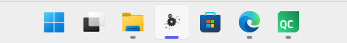
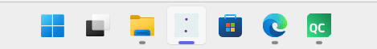
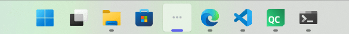
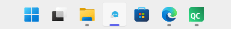
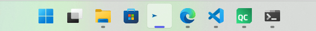
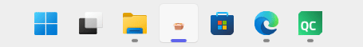
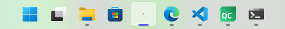
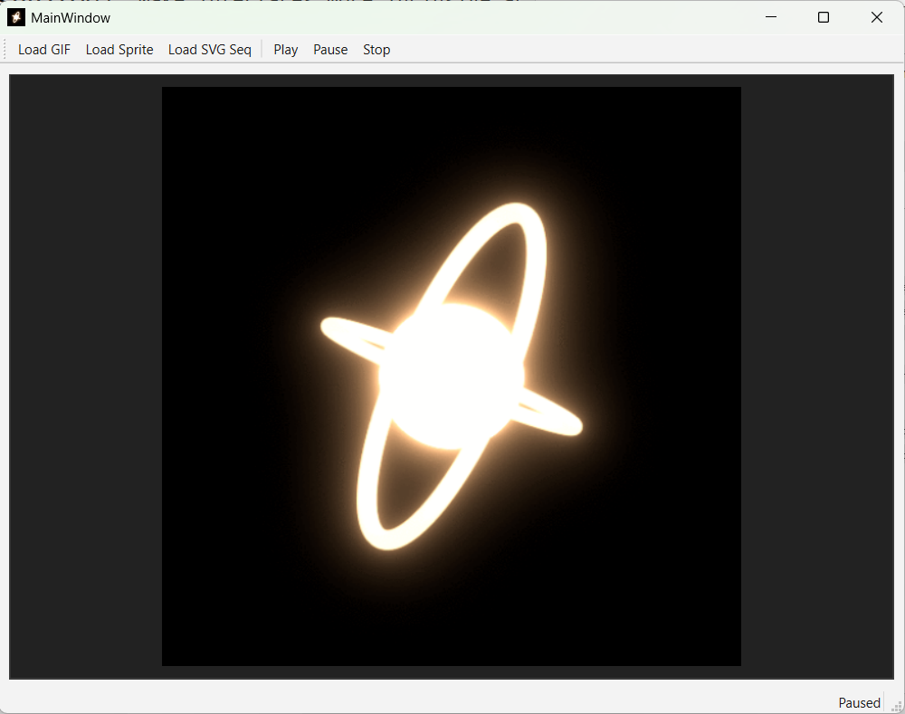

# QAwesomeIcon : real-time taskbar animated Icons

A revolutionary Qt library that transforms how we think about software interfaces through animated icons. **the first library of its kind** , a creative paradigm shift that opens up thousands of innovative ways to enhance user experience and software interaction. QAwesomeIcon supports multiple animation formats including GIF, sprite sheets, and SVG sequences, providing an intuitive API for creating dynamic window icons, taskbar icons, and system tray icons that bring your applications to life.

>  **No more boring Icons lets give a shoot to some Creativity** 

## Why Use it ?
Your app's taskbar icon is always visible, even when your app is minimized. Why not make it useful? QAwesomeIcon lets you communicate status, progress, and activity through that tiny icon at the bottom of the screen

## Revolutionary Features

- **Creative Paradigm Shift**: Transform static interfaces into dynamic, engaging experiences
- **Multiple Animation Formats**: Support for GIF, sprite sheets, and SVG sequences
- **Cross-Platform**: Works on Windows, macOS, and Linux
- **High DPI Support**: Automatic scaling for different display densities
- **Flexible Control**: Play, pause, stop, seek, and loop controls
- **Easy Integration**: Simple API for attaching animations to Qt widgets directly
- **Unlimited Creative Potential**: Thousands of innovative use cases waiting to be discovered

##  Creative Use Cases - The Future of Software Interfaces

I can think of **thousands of creative ways** to use QAwesomeIcon! Let me show you some of the possibilities:

---

##  **Loading States - Who Wants Boring Loading?**

Tired of boring static loading indicators? Transform your app's loading experience with animated icons that show **exactly** what's happening even from the Windows taskbar!
 and once the loading is finished you can see it directly without opening the app
### **exemples:**
- App startup progress
- File processing
- Network requests
- Data synchronization
- Background tasks

**gear.gif**  Perfect for settings, configuration, or system operations



**LoadingCircle.gif**  Classic spinning loader




>  **note**: Users can see your app's loading state even when it's minimized in the taskbar!

---

##  **Message & Communication - Add Creativity to Every Chat**

Make messaging apps come alive! Show typing indicators, message sending status, and communication states with engaging animations.

### **Possible Revolutionary Communication Features:**
- **Typing Indicators**: Show when someone is typing (like the PointsLoading animation)
- **Message Sending**: Visual feedback for message delivery
- **Chat Status**: Online, offline, busy states
- **Notification Badges**: Animated counters for unread messages
- **Avatar of the current Open chat**:see the avatar of the user you are talking to directly from the task bar and see the avatar talking when he is typing

**PointsLoading.gif** - Use this as a "typing indicator" 



**Texting.gif**  Perfect for messaging apps and chat applications



**SendingMessage.gif**  Ideal for email clients and instant messaging




>  **Game Changer**: Your users will know exactly when someone is typing, even from the taskbar!

---

##  **Gaming & Creative Applications - Bring Characters to Life**

### **Possible Ideas:**
- Character animations and states
- Level loading with themed animations
- Achievement unlocks
- Game status indicators

**No limite you can even show high quality animations:**

**CatAnimation.gif** 



**PlanetAnimation.gif**


---

##  **Error States & Feedback - Make Problems Beautiful**

**Error.gif**  Even errors can be engaging! Perfect for dialogs, warnings, and critical alerts and can be seen even if the app is minimized



---

##  **Even More Creative Ideas**

### ** Creative Industries**
- **Art Tools**: Animated brushes, color mixing, layer management
- **Music Production**: Audio waveforms, effect processing, recording status
- **Video Editing**: Timeline scrubbing, rendering progress, clip transitions

### ** Business Applications**
- **Dashboard Analytics**: Real-time data visualization, KPI indicators
- **Project Management**: Task progress, team collaboration status
- **E-commerce**: Shopping cart animations, payment processing, inventory updates

### ** Developer Tools**
- **Code Editors**: Syntax highlighting animations, compilation progress
- **Version Control**: Git status animations, merge conflicts, deployment progress
- **Testing**: Test execution progress, coverage reports, quality metrics

### ** Web & Cloud Services**
- **Cloud Storage**: File sync status, upload progress, storage capacity
- **Web Browsers**: Tab loading, download progress, security status
- **APIs**: Request/response cycles, rate limiting, service health

### ** User Experience Innovations**
- **Micro-interactions**: Button hover effects, form validation, user feedback
- **Accessibility**: Visual cues for hearing impaired users, attention grabbing alerts
- **Gamification**: Achievement unlocks, progress bars, reward systems
- **Emotional Design**: Mood indicators, personality expression, user satisfaction

> 🚀 **The possibilities are endless!** Every static icon in your application is an opportunity to create a more engaging, informative, and delightful user experience.


## Supported Animation Types

- **GIF**: Standard animated GIF files
- **Sprite Sheets**: Single image files containing multiple animation frames
- **SVG Sequences**: Multiple SVG files representing animation frames

lottie animations are planned for the future


### Qt Components Required
- Qt Core
- Qt Widgets
- Qt GUI
- Qt SVG
- Qt Concurrent
- Qt QML
- Qt Quick

## Building

### Prerequisites
Make sure you have Qt and CMake installed on your system.

### Build Instructions

1. Clone the repository:
```bash
git clone <repository-url>
cd QAwesomeIcon
```

2. Create a build directory:
```bash
mkdir build
cd build
```

3. Configure with CMake:
```bash
cmake ..
```

4. Build the project:
```bash
cmake --build .

```
**Or Use Qt Creator directly**


## Usage

### Basic Example

```cpp
#include "qawesomeicon.h"

// Create an animated icon
QAwesomeIcon* icon = new QAwesomeIcon(this);

// Load a GIF animation
icon->loadFromFile("path/to/animation.gif", QAwesomeAnimationType::GIF);

// Attach to a widget
icon->attachToWidget(myWidget);

// Start playing
icon->play(QAwesomeLoopMode::InfiniteLoop);
```

### Loading Different Animation Types

```cpp
// Load a GIF
icon->loadFromFile("animation.gif", QAwesomeAnimationType::GIF);

// Load a sprite sheet
icon->loadSpriteSheet("sprites.png", QSize(32, 32), 10, 5); // 10 frames, 5 per row

// Load SVG sequence
QStringList svgFiles = {"frame1.svg", "frame2.svg", "frame3.svg"};
icon->loadSvgSequence(svgFiles);
```

### Animation Control

```cpp
// Control playback
icon->play(QAwesomeLoopMode::InfiniteLoop);
icon->pause();
icon->resume();
icon->stop();

// Seek to specific frame
icon->seek(5);

// Configure settings
icon->setFrameRate(30);           // 30 FPS
icon->setSpeedFactor(1.5);        // 1.5x speed
icon->setScaleMode(QAwesomeScaleMode::KeepAspectRatio);
```

### High DPI Support

```cpp
// Set icon sizes for different DPI levels
QList<QSize> sizes = {QSize(16, 16), QSize(24, 24), QSize(32, 32), QSize(48, 48)};
icon->setIconSizes(sizes);

// Set device pixel ratio
icon->setDpr(2.0); // For 2x displays
```

##  The Creative Revolution in Software Development

QAwesomeIcon represents a fundamental shift in how we approach software interfaces. Instead of static, lifeless icons, we can now create:

### **Emotional Connections**
- **Personality**: Give your applications character and charm
- **Engagement**: Keep users interested and involved
- **Feedback**: Provide immediate visual responses to user actions

### **Functional Benefits**
- **Status Communication**: Instantly convey what's happening in your app
- **Progress Indication**: Show users that work is being done
- **Error Prevention**: Draw attention to important states or warnings

### **Innovation Opportunities**
- **New UI Patterns**: Create entirely new interaction paradigms
- **Accessibility**: Make interfaces more inclusive and understandable
- **Brand Differentiation**: Stand out in crowded software markets

## Example Application

The project includes a comprehensive example application that demonstrates all features using the included GIF animations:

### **Live Demo Animations**



```bash
# After building
./QAwesomeIconExample
```

## API Reference

### QAwesomeIcon Class

#### Loading Methods
- `loadFromFile(const QString& path, QAwesomeAnimationType type)`: Load animation from file
- `loadFromData(const QByteArray& data, QAwesomeAnimationType type)`: Load animation from data
- `loadSpriteSheet(const QString& imagePath, const QSize& frameSize, int frameCount, int framesPerRow)`: Load sprite sheet
- `loadSvgSequence(const QStringList& svgPaths)`: Load SVG sequence

#### Attachment Methods
- `attachToWidget(QWidget* widget, QAwesomeIconTargets targets)`: Attach to Qt widget
- `attachToWindow(QWindow* window, QAwesomeIconTargets targets)`: Attach to Qt window
- `detach()`: Remove attachment

#### Control Methods
- `play(QAwesomeLoopMode loopMode)`: Start playing animation
- `pause()`: Pause animation
- `resume()`: Resume paused animation
- `stop()`: Stop animation
- `seek(int frameIndex)`: Jump to specific frame

#### Configuration Methods
- `setFrameRate(int fps)`: Set animation frame rate
- `setSpeedFactor(qreal factor)`: Set playback speed multiplier
- `setScaleMode(QAwesomeScaleMode mode)`: Set scaling behavior
- `setIconSizes(const QList<QSize>& sizes)`: Set icon sizes for different DPI
- `setDpr(qreal dpr)`: Set device pixel ratio
- `setPriority(QAwesomeAnimationPriority priority)`: Set animation priority

#### Information Methods
- `frameCount()`: Get total number of frames
- `currentFrame()`: Get current frame index
- `frameSize()`: Get frame dimensions
- `state()`: Get current animation state
- `speedFactor()`: Get current speed factor
- `frameRate()`: Get current frame rate

#### Signals
- `frameChanged(int index)`: Emitted when frame changes
- `finished()`: Emitted when animation finishes
- `errorOccurred(const QString& message)`: Emitted on errors

### Enums

- `QAwesomeAnimationType`: Animation format types
- `QAwesomeAnimationState`: Current animation state
- `QAwesomeLoopMode`: Loop behavior options
- `QAwesomeScaleMode`: Scaling behavior options
- `QAwesomeAnimationPriority`: Animation priority levels
- `QAwesomeIconTarget`: Icon attachment targets

## Support
If you liked the idea of QAwesomeIcon and find it useful, don't forget to ⭐ star the repository!

## License

MIT License

### Version 1.0.0
- Initial release feel free to give more improvements and ideas on how to make it better the animation system for now still has lot of possible improvements
